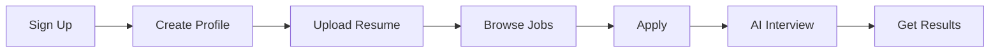
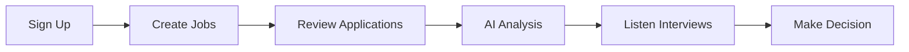

# 🤖 AI Recruiter Voice Agent

> **A revolutionary AI-powered recruitment platform that conducts intelligent voice interviews, evaluates candidates automatically, and provides comprehensive hiring insights.**

[](https://vercel.com/new/clone?repository-url=https://github.com/YOUR-USERNAME/ai-recruiter-agent)
[](https://nextjs.org/)
[](https://www.typescriptlang.org/)
[](https://supabase.com/)

## 🌟 **Demo**

**Live Demo:** [https://ai-recruiter-agent.vercel.app](https://ai-recruiter-agent.vercel.app) *(Replace with your deployed URL)*

**Test Accounts:**
- **Recruiter**: recruiter@demo.com / password123
- **Candidate**: candidate@demo.com / password123

## ⚡ **Quick Start (5 minutes)**

### 1️⃣ **Clone & Install**
```bash
git clone https://github.com/YOUR-USERNAME/ai-recruiter-agent.git
cd ai-recruiter-agent
npm install
```

### 2️⃣ **Environment Setup**
```bash
cp .env.example .env.local
```

**Fill in your API keys in `.env.local`:**

```env
# Supabase (Required for database & auth)
NEXT_PUBLIC_SUPABASE_URL=your_supabase_project_url
NEXT_PUBLIC_SUPABASE_ANON_KEY=your_supabase_anon_key

# Vapi (Required for voice interviews)
VAPI_API_KEY=your_vapi_private_key
NEXT_PUBLIC_VAPI_PUBLIC_KEY=your_vapi_public_key

# Google Gemini (Required for AI evaluation)
GEMINI_API_KEY=your_gemini_api_key
```

### 3️⃣ **Database Setup**
1. Create a [Supabase](https://supabase.com) project
2. Copy the entire content from `supabase-schema.sql`
3. Paste it in **Supabase → SQL Editor → New Query**
4. Click **Run**

### 4️⃣ **Storage Buckets**
In **Supabase → Storage**, create these buckets:
- `resumes` (Public: ✅)
- `audio` (Public: ✅)

### 5️⃣ **Start Development**
```bash
npm run dev
```

**🚀 Open [http://localhost:3000](http://localhost:3000)**

---

## 🔑 **API Keys Setup Guide**

### 🗄️ **Supabase** (Database & Authentication)
**Time:** 2 minutes | **Cost:** Free tier available

1. **Sign up:** [supabase.com](https://supabase.com)
2. **Create project** → Choose any name
3. **Get keys:** Settings → API
   - Copy **Project URL** → `NEXT_PUBLIC_SUPABASE_URL`
   - Copy **anon public** key → `NEXT_PUBLIC_SUPABASE_ANON_KEY`

### 🎙️ **Vapi** (AI Voice Interviews)
**Time:** 2 minutes | **Cost:** Free tier with minutes included

1. **Sign up:** [vapi.ai](https://vapi.ai)
2. **Dashboard** → API Keys
   - Copy **Private Key** → `VAPI_API_KEY`
   - Copy **Public Key** → `NEXT_PUBLIC_VAPI_PUBLIC_KEY`

### 🧠 **Google Gemini** (AI Question Generation & Evaluation)
**Time:** 2 minutes | **Cost:** Free tier generous

1. **Visit:** [Google AI Studio](https://aistudio.google.com)
2. **Create API Key**
   - Copy **API Key** → `GEMINI_API_KEY`

---

## 🚀 **Features Overview**

### 👨‍💼 **For Recruiters**
- ✅ **Smart Dashboard** - Real-time analytics and candidate pipeline
- ✅ **Job Management** - Create positions with AI-generated questions
- ✅ **Interview Analytics** - Audio, transcripts, and AI insights
- ✅ **Candidate Filtering** - Advanced search by skills, scores, status
- ✅ **Team Collaboration** - Share feedback and make hiring decisions

### 👨‍🎓 **For Candidates**
- ✅ **Profile Builder** - Upload resume, showcase skills and experience
- ✅ **Job Discovery** - Browse and apply to relevant positions
- ✅ **AI Voice Interview** - Natural conversation with intelligent AI
- ✅ **Instant Feedback** - Get detailed evaluation and improvement tips
- ✅ **Application Tracking** - Monitor your application status

### 🤖 **AI-Powered Features**
- ✅ **Dynamic Questions** - Role-specific questions generated by Gemini AI
- ✅ **Voice Recognition** - Natural speech processing via Vapi
- ✅ **Intelligent Evaluation** - Multi-criteria assessment (0-100 score)
- ✅ **Detailed Analysis** - Strengths, weaknesses, and recommendations
- ✅ **Real-time Transcription** - Automatic interview documentation

---

## 🏗️ **Architecture**

### **Tech Stack**
- **Frontend:** Next.js 15 + React + TypeScript + Tailwind CSS
- **Backend:** Next.js API Routes + Supabase Functions
- **Database:** PostgreSQL (Supabase) with Row Level Security
- **AI Voice:** Vapi for natural conversations
- **AI Text:** Google Gemini for questions and evaluation
- **Deployment:** Vercel (recommended) or any Next.js host

### **Key Components**
```
src/
├── app/                    # Next.js App Router
│   ├── api/               # API endpoints
│   ├── auth/              # Authentication pages
│   ├── candidate/         # Candidate portal
│   ├── dashboard/         # Recruiter dashboard
│   └── page.tsx           # Landing page
├── lib/                   # Core libraries
│   ├── supabase/          # Database client
│   ├── gemini.ts          # AI integration
│   └── vapi.ts            # Voice AI client
└── contexts/              # React contexts
```

---

## 🔄 **Complete User Journey**

### **Candidate Experience**


### **Recruiter Experience**


---

## 🚀 **Deployment**

### **Vercel (Recommended)**
[](https://vercel.com/new/clone?repository-url=https://github.com/YOUR-USERNAME/ai-recruiter-agent)

### **Manual Deployment**
1. **Push to GitHub**
2. **Connect to Vercel** → Import project
3. **Add Environment Variables** (same as `.env.local`)
4. **Configure Vapi Webhook:** `https://your-app.vercel.app/api/webhooks/vapi`
5. **Deploy!** 🚀

### **Other Platforms**
- **Netlify:** Works with minor config changes
- **Railway:** Full-stack deployment support
- **AWS/GCP:** Enterprise-grade hosting

---

## 📊 **Database Schema**

The app uses 7 main tables with proper relationships:

- 👤 **profiles** - User accounts and roles
- 💼 **job_positions** - Available jobs with requirements
- 🎯 **candidates** - Candidate profiles and resumes
- 📝 **applications** - Job applications
- 🎤 **interviews** - Voice interview records
- 📈 **interview_feedback** - Recruiter evaluations
- 🤖 **ai_prompts** - AI-generated content

**Full schema:** Check `supabase-schema.sql`

---

## 🔒 **Security Features**

- ✅ **Row Level Security (RLS)** - Database-level access control
- ✅ **JWT Authentication** - Secure user sessions
- ✅ **Role-based Access** - Candidate/Recruiter/Admin permissions
- ✅ **API Rate Limiting** - Prevent abuse
- ✅ **Input Validation** - Sanitized data processing
- ✅ **File Upload Security** - Safe resume/audio storage

---

## 🛠️ **Development**

### **Prerequisites**
- Node.js 18+
- npm or yarn
- Git

### **Local Development**
```bash
# Install dependencies
npm install

# Start development server
npm run dev

# Build for production
npm run build

# Start production server
npm start
```

### **Code Quality**
```bash
# Type checking
npm run type-check

# Linting
npm run lint

# Format code
npm run format
```

---

## 🤝 **Contributing**

We welcome contributions! Here's how:

1. **Fork** the repository
2. **Create** a feature branch: `git checkout -b feature/amazing-feature`
3. **Commit** your changes: `git commit -m 'Add amazing feature'`
4. **Push** to branch: `git push origin feature/amazing-feature`
5. **Open** a Pull Request

### **Development Guidelines**
- Follow TypeScript best practices
- Add proper error handling
- Write meaningful commit messages
- Test your changes locally
- Update documentation if needed

---

## 📄 **License**

This project is licensed under the **MIT License** - see [LICENSE](LICENSE) file for details.

---

## 🙏 **Acknowledgments**

- **Next.js Team** - Amazing React framework
- **Supabase** - Backend-as-a-Service platform
- **Vapi** - AI voice conversation platform
- **Google** - Gemini AI model
- **Vercel** - Deployment and hosting platform
- **Tailwind CSS** - Utility-first CSS framework

---

## 📞 **Support**

- **Documentation:** [GitHub Wiki](https://github.com/YOUR-USERNAME/ai-recruiter-agent/wiki)
- **Issues:** [GitHub Issues](https://github.com/YOUR-USERNAME/ai-recruiter-agent/issues)
- **Discussions:** [GitHub Discussions](https://github.com/YOUR-USERNAME/ai-recruiter-agent/discussions)

---

## 🌟 **Star the Repo**

If you found this project helpful, please give it a ⭐ on GitHub!

---

**🤖 Built with AI assistance from Claude Code**
**🚀 Generated with [Claude Code](https://claude.ai/code)**

**Co-Authored-By: Claude <noreply@anthropic.com>**